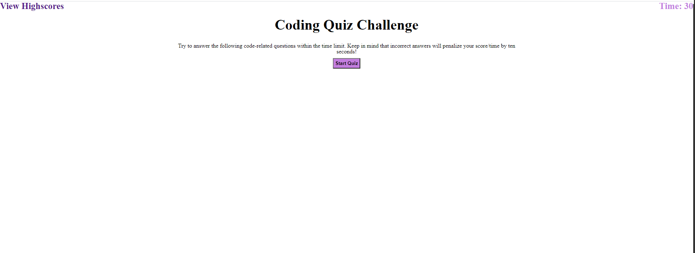
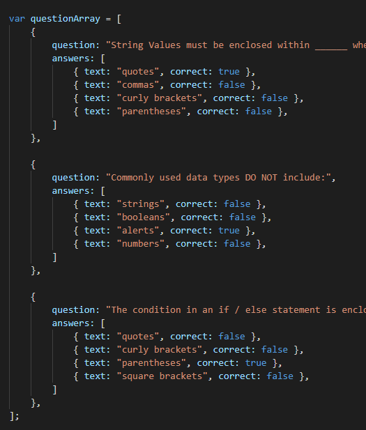

Coding Quiz Challenge

The live link: https://chandtheman1.github.io/04-Web-APIs-Code-Quiz/index.html

It has two HTML files (index.html and highscores.html), two JavaScript files (main.js and highscore.js) and one CSS file (main.css).

index.html calls the main.js file while the highscores.html calls the highscore.js respectively.

This is a coding quiz that tests your knowledge and is scored by the ending time. You start with 30 seconds. If you answered incorrectly, the time gets deducted by 10 seconds.

You can save your score into Highscores and view other previous scores. Highscores can be deleted as well.

This quiz question can be expanded by simply adding more into the questionsArray within the main.js.

